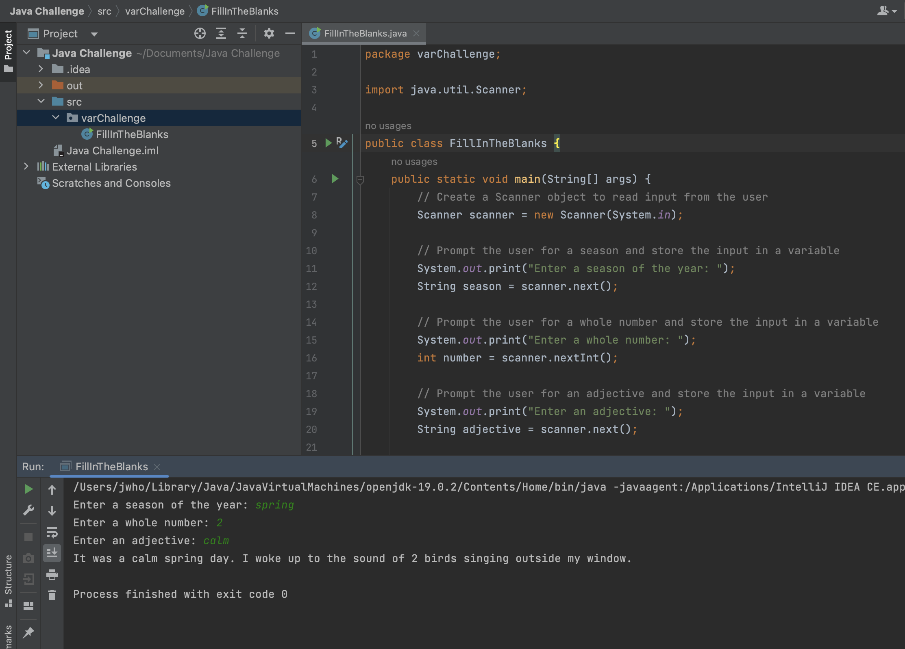

# Fill-In-The-Blank Story Program Challenge
This is a simple Java program that prompts the user for a season of the year, a whole number, and an adjective, and then prints out a story using those inputs. It's a fun exercise that demonstrates basic user input and output in Java.

## How to Run the Program
To run the program, you'll need to have Java installed on your computer. You can download the latest version of Java from the official Java website.

Once you have Java installed, follow these steps to run the program:

1. Open a terminal or command prompt on your computer.
2. Navigate to the directory where you've saved the FillInTheBlankStory.java file.
3. Compile the Java code by typing javac FillInTheBlankStory.java and pressing Enter.
4. Run the program by typing java FillInTheBlankStory and pressing Enter.

The program will then prompt you to enter a season of the year, a whole number, and an adjective. Type in your responses and press Enter after each one. The program will then print out a story using your inputs.

## How to Modify the Program
If you want to modify the program and create your own fill-in-the-blank story, you can do so by editing the FillInTheBlankStory.java file. You can change the prompts to ask for different types of input, and you can modify the story output to use your own custom template.

Here are some things you can try:

- Change the prompts to ask for different types of input, like a color or a type of animal.
- Modify the story output to use your own custom template. You could create a different story that uses the same inputs, or you could change the order of the inputs to create a different narrative.

## Conclusion
That's it for this simple Java program. It's a fun exercise that demonstrates basic user input and output in Java, and it's a great starting point for more complex Java programs. Thanks for reading!

## Screenshot 

